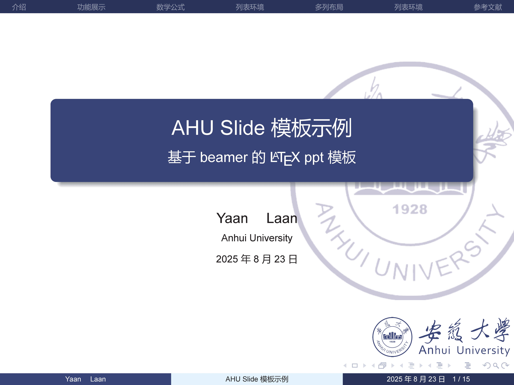
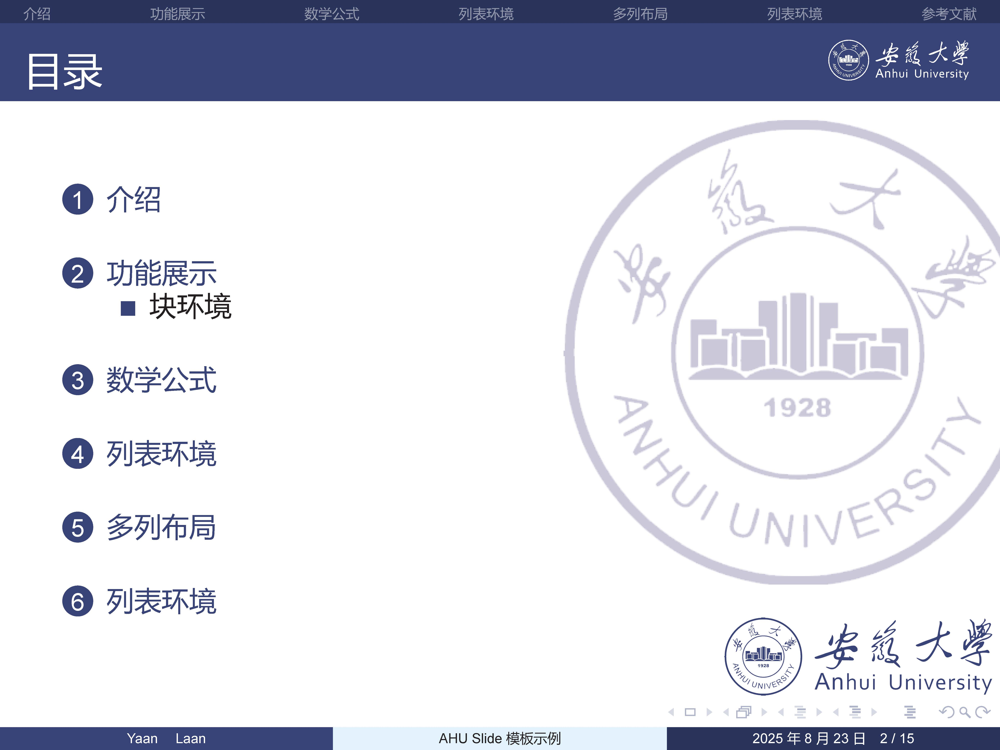
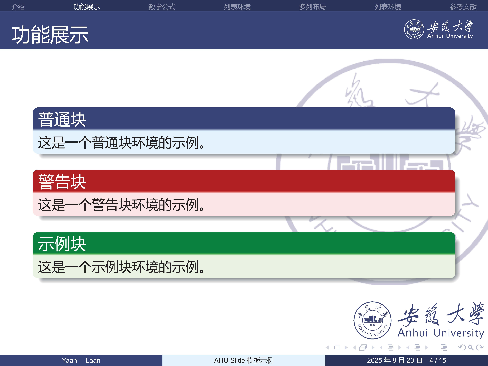
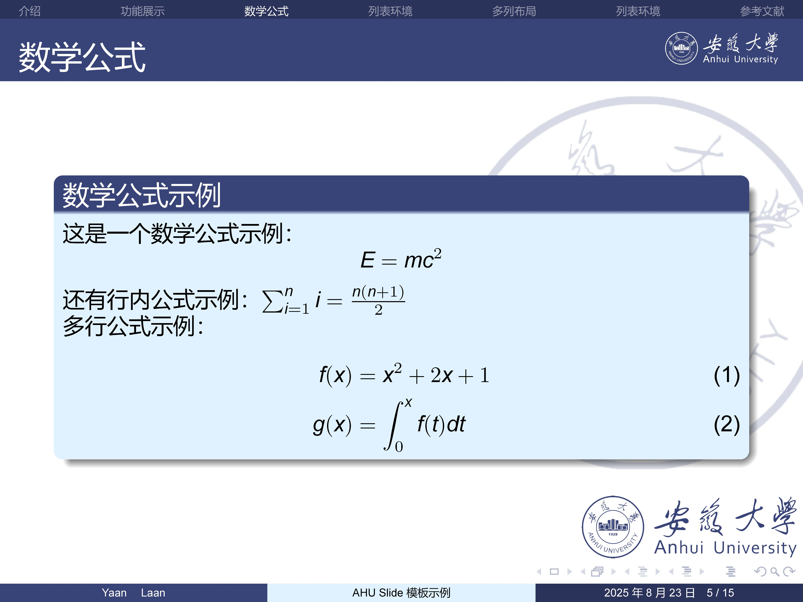
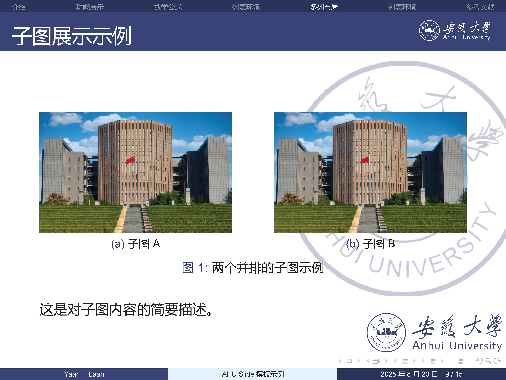
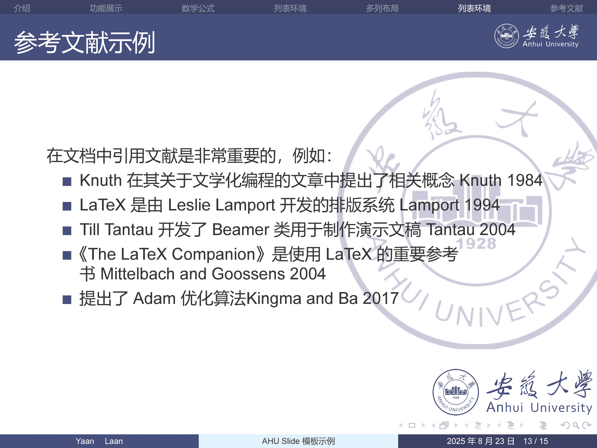
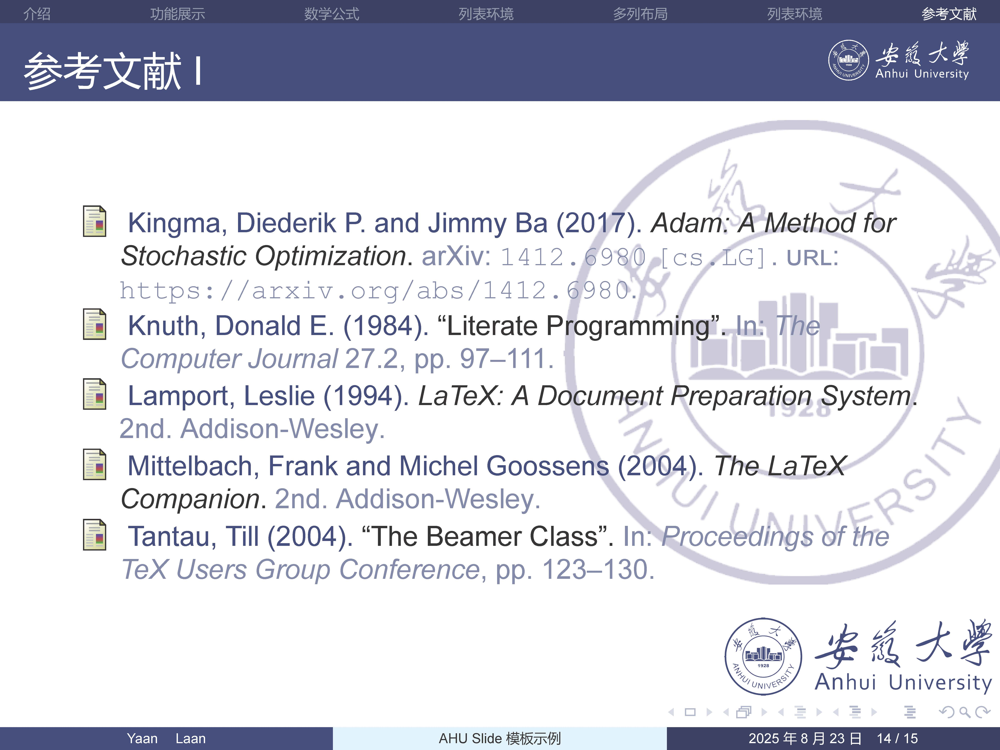
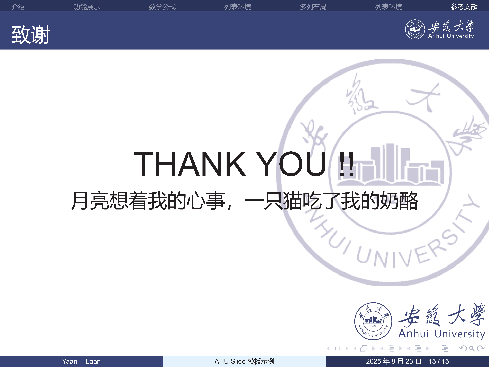

# AHU Beamer 模板

作为字典序排名第一的211高校，居然找不到自己的AHU beamer模板，实在是遗憾。于是做了个简单的demo。
其实主要是添加了三种水印，至于其他的格式可以自己调整。

## 预览图










## 项目结构

```
.
├── assets/                 # 资源文件夹（logo、背景等）
├── build/                  # 构建输出目录
├── citation/               # 参考文献文件
│   └── references.bib      # BibTeX 参考文献数据库
├── output/                 # 最终PDF输出目录
├── src/                    # 源文件（图片等）
├── style/                  # 样式文件
│   └── ahutheme.sty        # 自定义主题文件
├── main.tex                # 主 LaTeX 文件
├── Makefile                # 构建脚本
└── README.md               # 项目说明文件
```

## 功能特性

- 使用现代化的蓝白配色方案，符合安徽大学校徽颜色
- 支持中文排版（使用 ctex 宏包）
- 包含自定义主题 `ahutheme.sty`，可轻松定制外观
- 支持数学公式、列表、表格、图片等常见演示元素
- 使用 XeLaTeX 和 biber 管理参考文献
- 通过 Makefile 简化构建流程
- 支持多列布局、子图、TikZ 绘图等高级功能

## 环境要求

- TeX 发行版
- XeLaTeX 编译器
- biber
- GNU Make（用于简化构建流程）

## 使用方法

可以使用make命令构建，由于作者喜欢vscode的插件，所以有时候需要清理根目录的文件。
注意clean-all命令会删除pdf文件

### 构建演示文稿

```bash
# 构建演示文稿，最后在output和build下都生成output.pdf，NAME可选
make

# 或者使用 xelatex 直接编译，适合直接查看结果
make xelatex

# 完整构建xelatex-biber-xelatex*2，构建引用
make build
```

### 清理

```bash
# build中的辅助文件，保留pdf
make clean-build
# 清理根目录的辅助文件，保留pdf
make clean-root
# 同时执行两个清理
clean
# 清理所有辅助文件，并且删除pdf
make clean-all
```

### 自定义输出文件名

```bash
# 构建并指定输出文件名，空为main
make output NAME=my_presentation
```

最后会得到output文件夹下的my_presentation.pdf，注意会覆盖同名

## 修改AHU水印

> 可以点击超链接跳转对应代码段

### 背景水印

在 [style/ahutheme.sty](style/ahutheme.sty#L14)中修改以下内容：

```tex
% 设置背景图片，如果不喜欢可以更换背景或者注释隐藏
\pgfdeclareimage[width=\paperwidth,height=\paperheight]{background}{assets/background.pdf}
\setbeamertemplate{background}{
  \begin{pgfpicture}{0cm}{0cm}{\paperwidth}{\paperheight}
    % 背景图片
    \pgftext[at=\pgfpoint{0cm}{0cm},left,bottom]{\pgfuseimage{background}}
    % 添加半透明遮罩以提高文本可读性
    \pgfsetfillopacity{0.8}
    \pgfsetfillcolor{white}
    \pgfpathrectangle{\pgfpoint{0cm}{0cm}}{\pgfpoint{\paperwidth}{\paperheight}}
    \pgfusepath{fill}
  \end{pgfpicture}
}
```

### 框架水印（右上角）

在 [style/ahutheme.sty](style/ahutheme.sty#L58)中修改以下内容：

```tex
% 设置框架标题
\setbeamertemplate{frametitle}{
  \vspace{-0.25ex}% 微调垂直位置
  \begin{beamercolorbox}[wd=\paperwidth,ht=3ex,dp=0.8ex]{frametitle}
    \hspace*{0.3cm}\strut\insertframetitle\strut
    \hfill
    % 不喜欢右上角的logo可以注释隐藏
    \raisebox{0.2ex}{\includegraphics[height=2ex]{assets/logo.png}}\hspace*{0.4cm}
  \end{beamercolorbox}
}
```

### beamer自带logo水印功能（右下角）

在 [main.tex](main.tex#L22)中修改以下内容：

```tex
% 设置右下角的logo，注释可以取消
\logo{\includegraphics[height=1cm]{assets/logo2.png}}
```
## 关于修改

如果是外校，或者想要用于自己某个组织团体的话，只需要提取自己logo上的颜色并修改main、dark、light三处颜色设置就可以有很好的风格化效果。记得将水印替换成自己的。

## 许可证

遵循MIT许可证。
