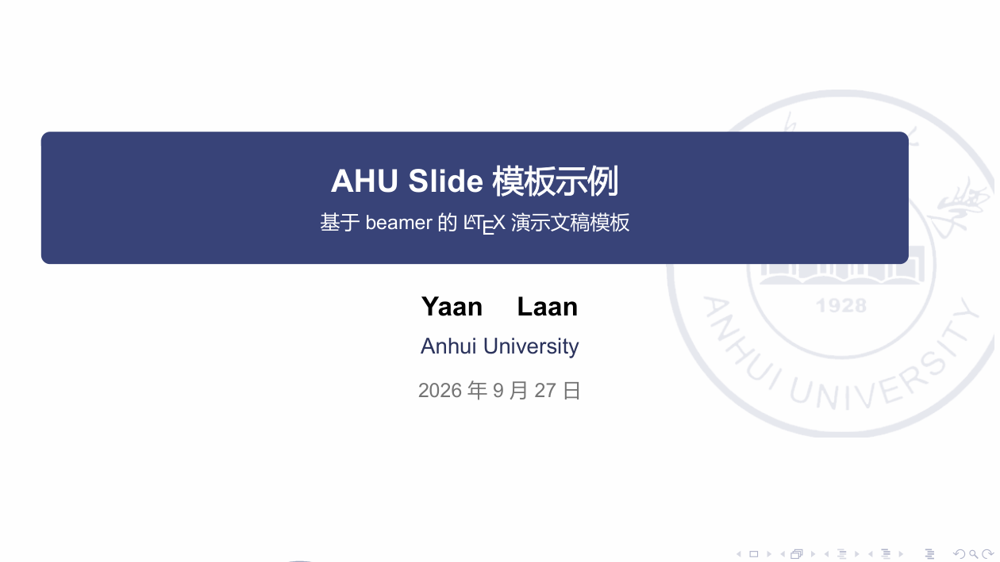
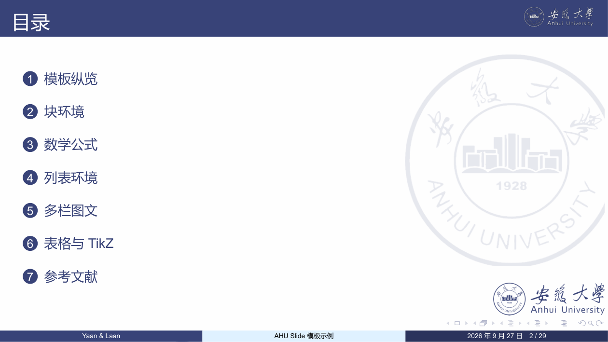
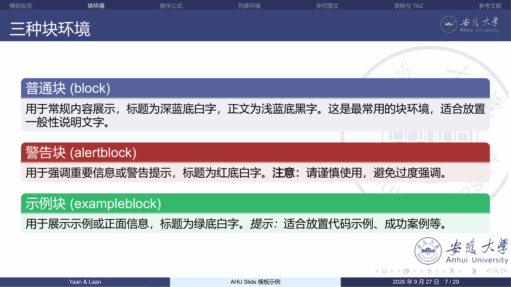
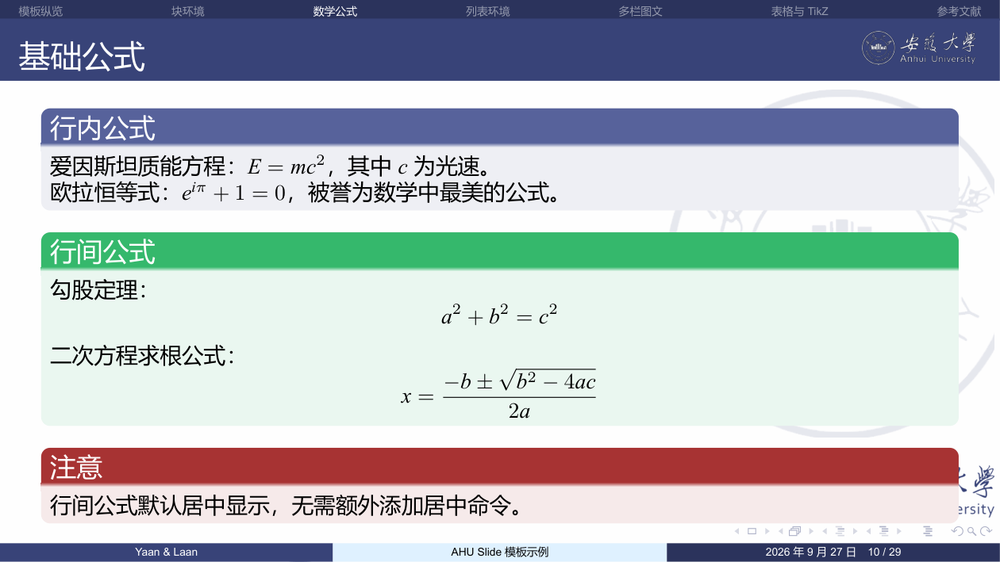
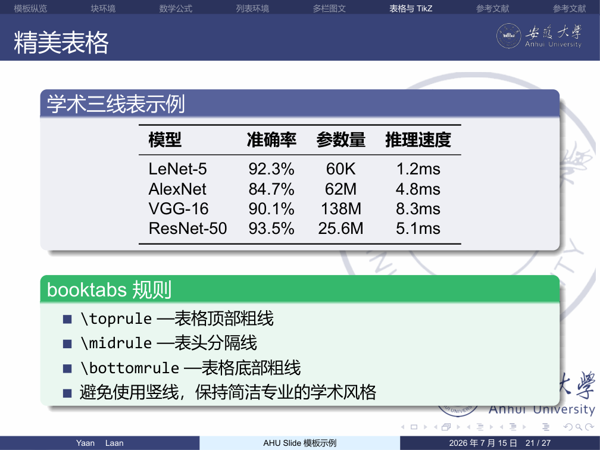
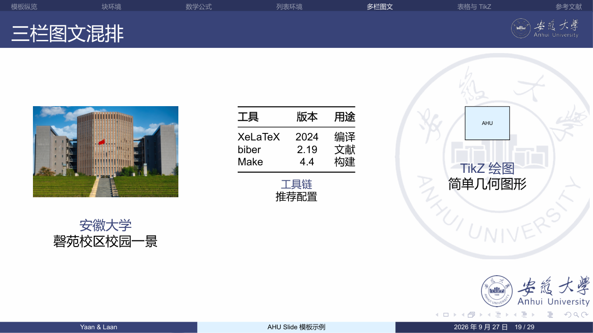
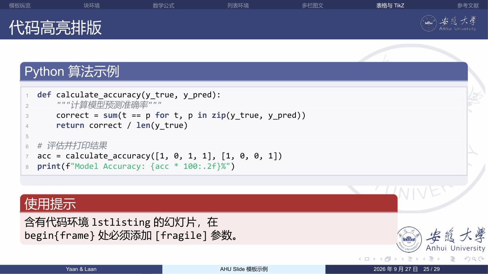
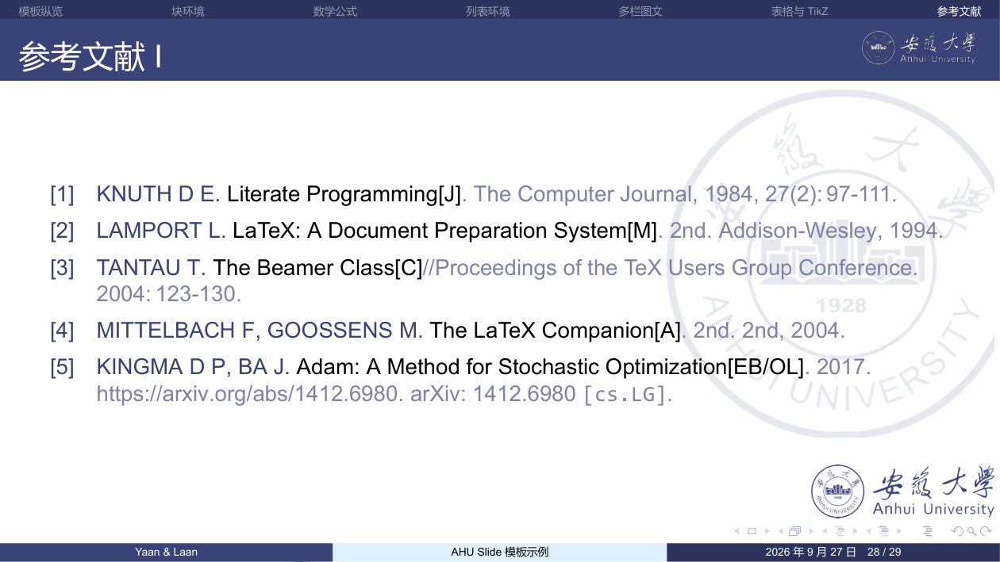
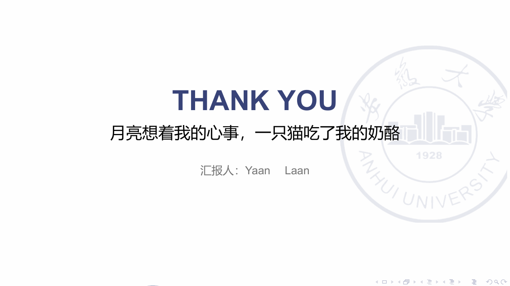

# AHU Beamer 模板

作为字典序排名第一的211高校，专门定制的安徽大学 Beamer 演示文稿模板。
采用现代 16:9 宽屏画幅，保留并优化了三种可选水印方案。

## 预览图











## 项目结构

```
.
├── Makefile        # make 编译与清理脚本
├── README.md       # 项目说明与使用文档
├── ahubeamer-skills
│   └── SKILL.md    # 模板开发规范与三层架构编写指南
├── assets          # 静态资源（背景底纹、校徽logo、预览图）
├── build           # 编译生成临时辅助文件目录
├── citation        # 参考文献数据库 (references.bib)
├── main.tex        # 演示文稿主入口文件
├── output          # 最终交付 PDF 输出目录
├── pages           # 固定页面（封面、目录、致谢等）
├── sections        # 正文内容章节（采用标准三层结构）
├── src             # 演示配图等静态资源
└── style           # 自定义样式主题包（ahutheme.sty）
```

## 功能特性

- **16:9 现代宽屏比例**：适配宽屏投影仪与现代显示器，大幅扩展横向排版呼吸感
- **专属安大视觉规范**：提取安徽大学校徽主色调（主深蓝、清透浅蓝、警示红、示例绿）
- **完整中文字体支持**：基于 `ctex` 宏包，配置中文字体伪粗体与伪斜体，消除排版警告
- **三种可选独立水印**：
  1. 背景底纹水印（带半透明白色遮罩，高对比度）
  2. 框架标题栏右上角小 Logo
  3. 右下角 Beamer 原生 Logo
- **清晰三层架构**：主文件 -> 节头索引 -> 原子 Frame，解耦清晰
- **代码高亮环境**：内置 `listings` 宏包与定制 `ahustyle` 代码主题，开箱即用
- **动态演示支持**：支持 `<+->` 与 `\pause` 逐步揭示与动态高亮聚焦动画
- **参考文献国标支持**：基于 XeLaTeX + biber 处理，遵循国标 `gb7714-2015`
- **完整构建流水线**：提供便捷的 Makefile 构建指令

## 环境要求

- TeX 发行版（TeX Live / MiKTeX）
- XeLaTeX 编译器
- biber 文献处理工具
- GNU Make（用于命令行快速构建）

## 使用方法

```bash
# 完整构建演示文稿（xelatex -> biber -> xelatex*2），最终生成 output/main.pdf
make

# 或者使用 xelatex 直接快速编译（适合编写文字时即时预览）
make xelatex

# 完整构建引用
make build

# 构建并指定输出文件名
make output NAME=my_presentation
```

### 清理

```bash
# 清理 build 中的辅助文件，保留 pdf
make clean-build
# 清理根目录的辅助文件，保留 pdf
make clean-root
# 同时执行两个清理
make clean
# 清理所有辅助文件，并且删除 pdf
make clean-all
```

## 水印设置（三者均可选，可自由组合）

### 1. 背景底纹水印（可选）
在 [style/ahutheme.sty](style/ahutheme.sty) 中修改或注释对应内容：

```tex
% 设置背景图片，如果不喜欢可以更换背景或者注释整段隐藏
\setbeamertemplate{background}{
  \begin{pgfpicture}{0cm}{0cm}{\paperwidth}{\paperheight}
    \pgftext[at=\pgfpoint{\paperwidth}{0.5\paperheight},right]{
      \includegraphics[width=\paperwidth, height=\paperheight, keepaspectratio=true]{assets/background.pdf}
    }
    \pgfsetfillopacity{0.88}
    \pgfsetfillcolor{white}
    \pgfpathrectangle{\pgfpoint{0cm}{0cm}}{\pgfpoint{\paperwidth}{\paperheight}}
    \pgfusepath{fill}
  \end{pgfpicture}
}
```

### 2. 框架标题右上角 Logo 水印（可选）
在 [style/ahutheme.sty](style/ahutheme.sty) 中修改：

```tex
% 若不需要右上角的logo，可以注释 \raisebox{...} 一行
\setbeamertemplate{frametitle}{
  \vspace{-0.25ex}
  \begin{beamercolorbox}[wd=\paperwidth,ht=3ex,dp=0.8ex]{frametitle}
    \hspace*{0.3cm}\strut\insertframetitle\strut
    \hfill
    \raisebox{0.2ex}{\includegraphics[height=2ex, keepaspectratio]{assets/logo.png}}\hspace*{0.4cm}
  \end{beamercolorbox}
}
```

### 3. 右下角原生 Logo 水印（可选）
在 [main.tex](main.tex) 中修改：

```tex
% 注释此行可取消右下角的 logo
\logo{\includegraphics[height=0.85cm]{assets/logo2.png}}
```

## 许可证

遵循 MIT 许可证。
